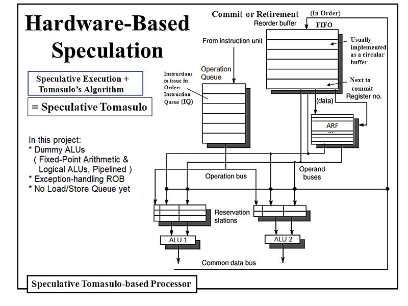

# Hardware-based Speculation (Speculative Tomasulo)
An Out-of-Order Processor in VHDL based on the Speculative Tomasulo algorithm.  
Computer Architecture coursework, Technical University of Crete, School of ECE.

For this project, only behavioral simulation was requested from us, so the code hasn't been thoroughly tested beyond that. The code is synthesizable in Vivado 2018.1. In older software (like ISE 14.7) INSTRUCTION_FETCH, which uses functions to handle the "rom.data" file as a ROM, is not synthesizable. However, you should be able to synthesize the design with older software by replacing those functions with an initialized BRAM.

 
