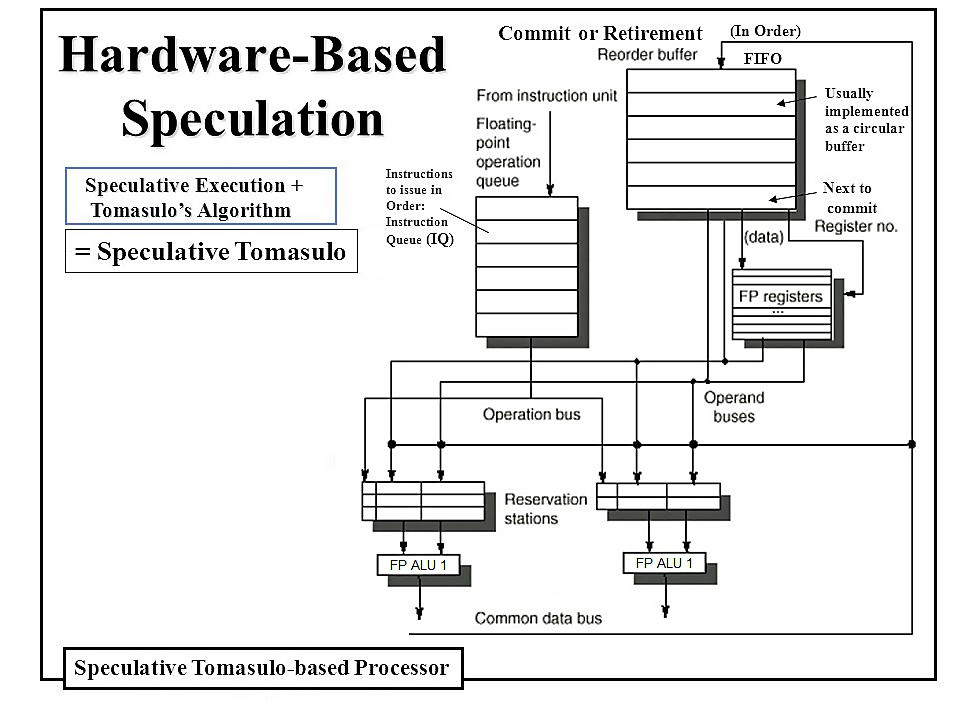

# Hardware-based Speculation (Speculative Tomasulo)
An Out-of-Order Processor in VHDL based on the Speculative Tomasulo algorithm.  
Computer Architecture coursework, Technical University of Crete, School of ECE

 
